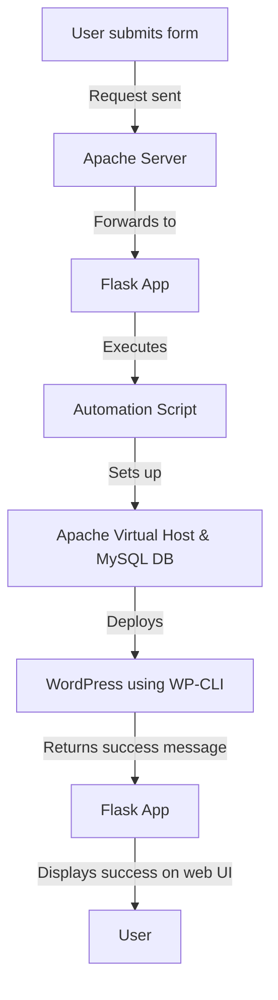

# 🚀 Automated WordPress Deployment on Ubuntu VM

## 📌 Project Overview
This project automates the deployment of WordPress on a Virtual Machine (VM) running Ubuntu Server inside **Oracle VirtualBox**. The automation is handled using **Flask** and **WP-CLI**, eliminating manual WordPress setup. The project also integrates **Apache**, **MySQL**, and **PHP** for a fully functional web hosting environment.

## 🛠️ Technologies Used
- **Ubuntu Server** (Virtual Machine on VirtualBox)
- **Apache2** (Web Server)
- **MySQL Server** (Database)
- **PHP 8.3** (Required for WordPress)
- **WP-CLI** (Command Line Interface for WordPress)
- **Flask** (Python-based Web Framework for automation API)
- **Systemd Services** (For managing Flask application as a background service)
- **Bash Scripting** (Automating WordPress installation)
- **Virtual Hosts** (Multiple domain setup using Apache)

---

## ⚙️ Features
- Automates **WordPress installation** using WP-CLI.
- Provides a **Flask-based API** to trigger automation.
- Uses **Apache Virtual Hosts** for domain-based WordPress deployment.
- **Auto-creates MySQL database & user** for each WordPress site.
- **Manages Apache configuration dynamically** for multiple WordPress installations.
- **Integrated with Flask** to receive requests from a web-based form.

---

## 🎯 Objectives Achieved

This project successfully automates the deployment of **WordPress** on an **Ubuntu Server** running inside a **Virtual Machine (VM) on VirtualBox**. The key objectives achieved include:

- ✅ **Set up an Ubuntu Server VM** in **Oracle VirtualBox** with all necessary dependencies.
- ✅ **Installed and configured Apache, MySQL, PHP, and WP-CLI** for WordPress deployment.
- ✅ **Automated WordPress installation** using a **custom Bash script** (`wp-setup`).
- ✅ **Integrated Apache with Flask** to handle deployment requests via a **web UI**.
- ✅ **Configured Apache as a reverse proxy** to forward requests to the Flask application.
- ✅ **Enabled automation through a form-based UI** to deploy WordPress dynamically.
- ✅ **Created a systemd service for Flask**, ensuring the web service runs continuously.
- ✅ **Allowed multiple domain deployments dynamically** using a single automation script.

---

## 🔀 System Architecture & Flowchart  

---

## 🚀 Future Improvements

To make this project production-ready, the following improvements can be implemented:

- 🔹 **Use Gunicorn to run Flask** instead of the development server.
- 🔹 **Implement HTTPS with Let's Encrypt** for secure connections.
- 🔹 **Use Docker to containerize the entire setup** for easier deployment.
- 🔹 **Set up a centralized logging system** for Apache, Flask, and Bash script logs.
- 🔹 **Automate domain management with a DNS provider** for real-world deployments.
- 🔹 **Implement database backups and restore functionality**.
- 🔹 **Enable authentication for the deployment UI** to prevent unauthorized access.
- 🔹 **Optimize the automation script** to support WordPress plugin/theme installations.
- 🔹 **Use Ansible or Terraform** for infrastructure-as-code automation.
- 🔹 **Host the solution on a cloud provider (AWS, GCP, DigitalOcean)** instead of a local VM.

